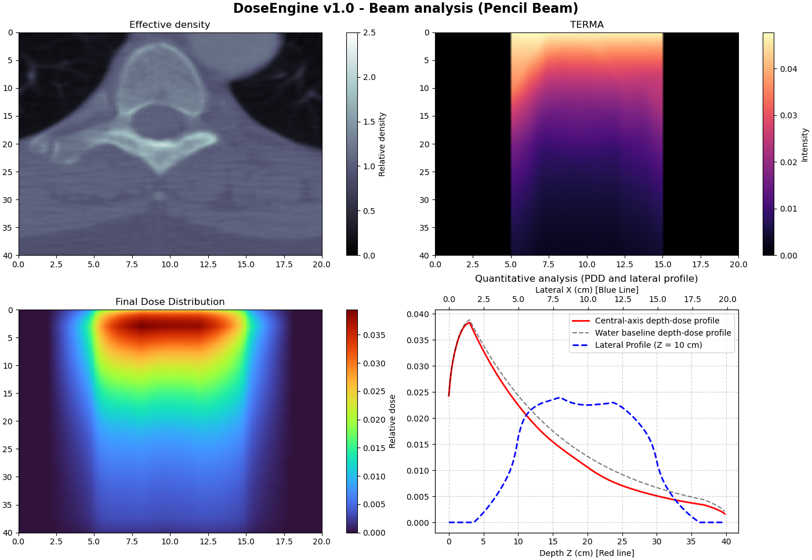
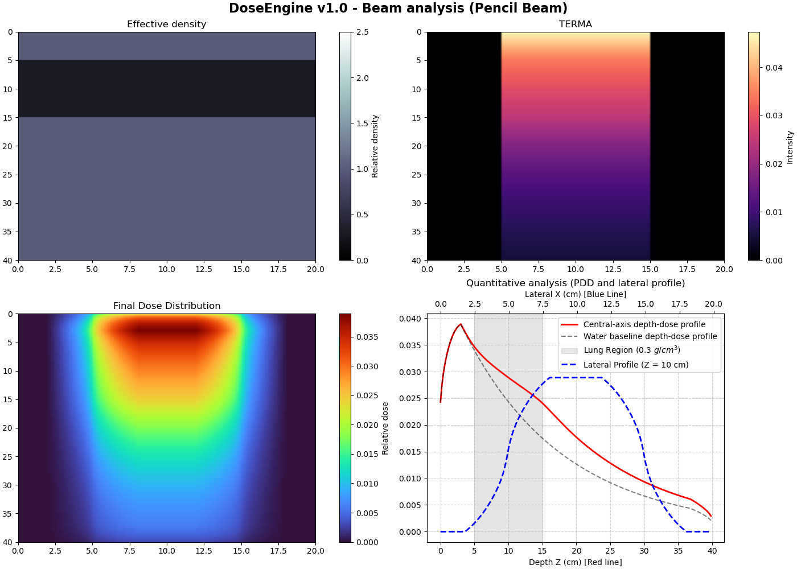
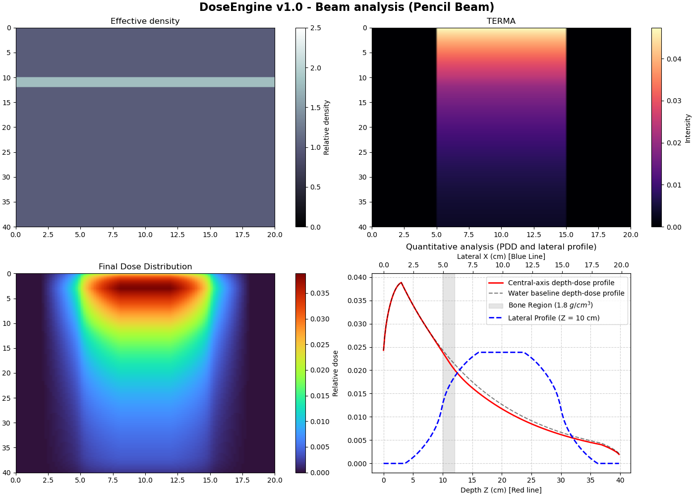

# DoseEngine 

> An educational, transparent, and modular 2D dose calculation platform for external photon beam radiotherapy.

**DoseEngine** is a Python project developed to explore the physical and computational principles behind model-based photon dose calculation algorithms used in radiotherapy Treatment Planning Systems (TPS).

Rather than reproducing the complexity of a commercial TPS as a closed “black box”, DoseEngine exposes each stage of a simplified dose calculation pipeline. The project shows how tissue density affects primary photon attenuation, how released energy can be represented through a relative TERMA distribution, and how secondary energy transport can be approximated through convolution with a dose spread kernel.

The engine can perform simulations on configurable density phantoms or on CT images in DICOM format after converting Hounsfield Units into relative density.



*Example output showing the density map, relative TERMA distribution, final dose distribution, central-axis depth-dose profile, and lateral profile.*

---

## Key Features

- **Radiological depth calculation**  
  Computes the accumulated density-weighted path length along the beam direction.

- **Primary photon transport**  
  Models photon fluence attenuation using the Beer–Lambert law and an inverse-square correction.

- **Relative TERMA estimation**  
  Represents the spatial distribution of energy released by the primary photon field before secondary transport.

- **Pencil Beam Convolution**  
  Convolves the TERMA distribution with a normalized empirical 2D dose spread kernel.

- **Configurable heterogeneous phantoms**  
  Supports homogeneous water media and customizable density distributions, including predefined lung and bone scenarios.

- **DICOM CT integration**  
  Reads CT images, converts stored pixel values into Hounsfield Units, resamples the image to the computational grid, and estimates relative density.

- **Configurable simulation parameters**  
  Allows modification of grid dimensions, beam energy, field size, source-to-surface distance, calculation model, and heterogeneity corrections.

- **Dose visualization and analysis**  
  Produces density, TERMA, and dose maps, together with central-axis depth-dose and lateral profiles.

- **Modular architecture**  
  Separates image processing, phantom generation, primary transport, kernel generation, convolution, visualization, and simulation control.

---

## Physical Model

DoseEngine currently implements a simplified two-dimensional workflow based on **Pencil Beam Convolution**.

The calculation is divided into independent stages so that each physical approximation can be inspected and modified separately.

### 1. Input density map

The calculation medium can be generated from:

- a homogeneous water phantom;
- a predefined lung or bone phantom;
- a fully customizable relative-density matrix;
- a CT image in DICOM format.

For CT images, the stored pixel values are first converted into Hounsfield Units:

$$
HU = \text{pixel value} \times \text{RescaleSlope}
     + \text{RescaleIntercept}
$$

A simplified linear calibration is then used to estimate relative density:

$$
\rho_{\mathrm{rel}} = 1 + \frac{HU}{1000}
$$

This relation is used exclusively for educational purposes and does not represent a scanner-specific clinical calibration curve.

### 2. Radiological depth

For a beam travelling along the positive depth axis, the accumulated radiological depth is calculated as:

$$
d_{\mathrm{eff}}(z,x) = \sum_{z'=0}^{z} \rho_{\mathrm{rel}}(z',x)\,\Delta z
$$

This produces a water-equivalent path length that accounts for density variations along each beam path.

### 3. Primary photon fluence

Primary fluence is estimated using exponential attenuation:

$$
\Phi(z,x) = \Phi_0 \exp\left[-\mu_{\mathrm{water}}d_{\mathrm{eff}}(z,x)\right] \left( \frac{SSD}{SSD+z} \right)^2
$$

The second factor represents the inverse-square reduction in fluence with increasing distance from the source.

### 4. Relative TERMA

The relative TERMA distribution is estimated as:

$$
T(z,x) \propto
\mu_{\mathrm{water}}\Phi(z,x)
$$

In the current implementation, TERMA is a relative quantity and is not expressed in absolute energy or dose units.

### 5. Dose spread kernel

Secondary energy transport is represented using an empirical isotropic kernel composed of two exponential terms:

$$ K(r) = A e^{-ar} + B e^{-br} $$

The narrow component represents the central concentration of deposited energy, while the broader component produces a lower-amplitude tail.

The kernel is normalized so that:

$$
\sum K = 1
$$

### 6. Dose convolution

The final relative dose distribution is obtained through the two-dimensional convolution:

$$
D(z,x) = T(z,x) * K(z,x)
$$

where $T$ is the relative TERMA distribution and $$K$ is the dose spread kernel.

---

## Calculation Pipeline

```text
Phantom or DICOM CT
          │
          ▼
Relative density matrix
          │
          ▼
Radiological depth
          │
          ▼
Primary photon fluence
          │
          ▼
Relative TERMA
          │
          ▼
Dose spread kernel
          │
          ▼
2D spatial convolution
          │
          ▼
Relative dose distribution
          │
          ▼
Dose maps and profiles

## Repository Structure

```text
DoseEngine/
├── .gitignore
├── README.md                       # Project overview and documentation
├── requirements.txt                # Core Python dependencies
├── requirements-notebook.txt       # Optional notebook dependencies
├── Demo.ipynb                      # Interactive walkthrough of the model
├── data/
│   └── ct/                         # Local DICOM test data
├── images/                         # README figures and simulation outputs
└── dose_engine/
    ├── config.py                   # Grid, beam, and engine configuration
    ├── phantom.py                  # Configurable 2D phantom generation
    ├── ct.py                       # DICOM loading and image resampling
    ├── density.py                  # HU-to-density conversion and corrections
    ├── physics.py                  # Radiological depth, fluence, and TERMA
    ├── kernel.py                   # Empirical dose spread kernel
    ├── convolution.py              # TERMA-kernel convolution
    ├── engine.py                   # Dose calculation pipeline coordinator
    └── main.py                     # Command-line execution and visualization
```

---

## Requirements

DoseEngine requires Python and the following core libraries:

- Python 3.10 or later
- NumPy
- SciPy
- Matplotlib
- pydicom

The core dependencies are listed in `requirements.txt`:

```text
numpy>=1.24,<3.0
scipy>=1.10,<2.0
matplotlib>=3.7,<4.0
pydicom>=2.4,<4.0
```

The interactive notebook additionally requires JupyterLab and IPython Kernel. These optional dependencies are listed in `requirements-notebook.txt`:

```text
-r requirements.txt

jupyterlab>=4.0,<5.0
ipykernel>=6.0,<7.0
```

---

##  Quick Start

### 1. Clone the repository

```bash
git clone https://github.com/<henrique-c727>/DoseEngine.git
cd DoseEngine
```

### 2. Create a virtual environment

Using `venv`:

```bash
python -m venv .venv
```

Activate it on Windows:

```bash
.venv\Scripts\activate
```

Activate it on Linux or macOS:

```bash
source .venv/bin/activate
```

### 3. Install the dependencies

To run the main application:

```bash
pip install -r requirements.txt
```

To run both the application and the interactive notebook:

```bash
pip install -r requirements-notebook.txt
```

### 4. Run a simulation

Lung phantom:

```bash
python main.py --phantom lung
```

Bone phantom:

```bash
python main.py --phantom bone
```

Homogeneous water phantom:

```bash
python main.py --phantom water
```

Custom phantom:

```bash
python main.py --phantom custom
```

DICOM CT image:

```bash
python main.py --phantom ct --ct_path data/ct/example.dcm
```

A valid local DICOM filepath must be provided when the CT simulation mode is selected.
> **PowerShell note:** Enclose the DICOM filepath in quotation marks if it contains spaces.

---

## Simulation Output

Each simulation produces a figure containing:

1. the relative-density distribution;
2. the relative TERMA distribution;
3. the final relative-dose distribution;
4. a central-axis depth-dose profile;
5. a lateral dose profile at a selected depth;
6. a homogeneous-water reference for comparison.

The results are intended for qualitative analysis of the physical and computational behaviour of the model.



*Example output containing the density map, relative TERMA distribution, relative dose distribution, central-axis depth-dose profile, and lateral profile.*

---

## ⚙️ Configuration

The main simulation parameters are defined in `config.py`.

```python
GRID = {
    "dx": 0.2,
    "dz": 0.2,
    "nx": 100,
    "nz": 200
}

BEAM = {
    "energy_mv": 6,
    "field_size_cm": 10.0,
    "ssd_cm": 100.0
}

ENGINE = {
    "model_type": "pencil_beam",
    "apply_etar": False,
    "etar_sigma": 1.0
}
```

### Grid parameters

- `dx`: lateral voxel dimension in centimetres;
- `dz`: depth voxel dimension in centimetres;
- `nx`: number of lateral voxels;
- `nz`: number of depth voxels.

### Beam parameters

- `energy_mv`: nominal photon beam energy;
- `field_size_cm`: lateral field size at the phantom surface;
- `ssd_cm`: source-to-surface distance.

### Engine parameters

- `model_type`: selected calculation model;
- `apply_etar`: enables or disables the optional ETAR-inspired correction;
- `etar_sigma`: Gaussian smoothing scale used by the qualitative heterogeneity correction.

The current photon transport model uses a constant effective attenuation coefficient. Consequently, changing the nominal beam energy does not yet generate an energy-dependent beam spectrum or attenuation model.

---

## Interactive Demonstration

The `demo.ipynb` notebook presents the calculation pipeline step by step, currently only available in portuguese and may be updated over time. 

It can be used to inspect:

- phantom construction;
- radiological-depth accumulation;
- primary photon fluence attenuation;
- relative TERMA generation;
- dose spread kernel shape;
- convolution and final dose distribution;
- the influence of heterogeneous media on primary attenuation.

The notebook provides a more guided introduction to the physical assumptions and numerical implementation than the command-line interface.

To open it:

```bash
jupyter lab demo.ipynb
```

---

## Current Limitations

DoseEngine v1.0 is intentionally simplified.

- The calculation is two-dimensional.
- A single axial CT slice is treated as a two-dimensional calculation medium.
- The beam propagates from the top of the matrix along a fixed direction.
- Oblique beam incidence and beam rotation are not currently supported.
- The field width is fixed across the calculation grid and does not include geometrical beam divergence.
- The attenuation coefficient is represented by a constant effective value.
- TERMA and dose are relative rather than absolute quantities.
- The dose spread kernel is empirical, isotropic, and spatially invariant.
- Tissue-dependent secondary-particle transport is not explicitly modelled.
- CT images are resampled to the computational grid without reconstructing their original physical spacing, orientation, or full patient geometry.
- The HU-to-density conversion uses a simplified linear relationship rather than a scanner-specific calibration curve.
- The optional ETAR-inspired correction is qualitative and is not a clinical implementation of the ETAR method.
- The model has not been validated against clinical measurements, Monte Carlo simulations, or commercial treatment-planning software.

These limitations are documented explicitly because the project is intended to expose and explore modelling assumptions rather than conceal them.

---

## Planned Development

Possible directions for future versions include:

- density-adaptive dose spread kernels;
- improved heterogeneity corrections;
- ray-traced radiological paths for oblique beam incidence;
- beam rotation and multiple beam directions;
- three-dimensional calculation geometries;
- preservation of DICOM physical spacing and orientation;
- scanner-specific CT calibration support;
- energy-dependent attenuation and kernel parameters;
- development and comparison of additional model-based dose calculation approaches, including an educational AAA-inspired model;
- quantitative validation using reference depth-dose and lateral-profile data.

The modular architecture was designed to allow these components to be introduced progressively without replacing the complete calculation pipeline.

---

## Project Motivation

DoseEngine was developed as a personal learning project in preparation for further study in Medical Physics.

Its development involved the study and interpretation of scientific and technical literature related to:

- external beam radiotherapy;
- radiation dosimetry;
- photon interactions with matter;
- model-based dose calculation algorithms;
- treatment-planning systems;
- medical image processing;
- scientific computing and numerical modelling.

The project aims to connect theoretical physics, numerical methods, and scientific software development through a transparent implementation whose individual components can be inspected, modified, and progressively extended.

---

## Disclaimer

**DoseEngine is intended exclusively for educational and academic purposes.**

It is a simplified didactic prototype and is **not** a clinical Treatment Planning System. It has not undergone the validation, commissioning, quality assurance, or regulatory processes required for medical software.

It must never be used for:

- clinical decision-making;
- patient treatment planning;
- dose prescription;
- dosimetric calibration;
- verification of clinical treatment plans;
- estimation of clinically deliverable patient dose.

No result generated by this software should be interpreted as a clinically accurate dose calculation.


